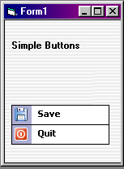



## NetButton

### Description

Its a button .... what else does a button do ?

Note : I have fixed the click event problem :) My mistake ..... who else would it be ?
 
### More Info
 
Don't you just love the .Net buttons ? This is a painfully shy attempt to emulate the buttons, I'm doing it 'coz I was bored. It lacks a lot of functions but it gets the job done :) Anyway, most of it were done using the wizard that comes with VB6.0. Hope you guys like it ..... if you people really want a super cool .Net button try getting it from

www.vbsmart.com

that button over there is awesome and my buttons is a pale comparison to it :) hahahahha, anyway, hope you guys love it. Any contructive feedback is welcomed .....

             |
---                |---
**Submitted On**   |2001-09-15 15:23:40
**By**             |[Janarayson](https://github.com/Planet-Source-Code/PSCIndex/blob/master/ByAuthor/janarayson.md)
**Level**          |Beginner
**User Rating**    |4.7 (14 globes from 3 users)
**Compatibility**  |VB 5\.0, VB 6\.0
**Category**       |[Custom Controls/ Forms/  Menus](https://github.com/Planet-Source-Code/PSCIndex/blob/master/ByCategory/custom-controls-forms-menus__1-4.md)
**World**          |[Visual Basic](https://github.com/Planet-Source-Code/PSCIndex/blob/master/ByWorld/visual-basic.md)
**Archive File**   |[NetButton264569152001\.zip](https://github.com/Planet-Source-Code/janarayson-netbutton__1-27234/archive/master.zip)

